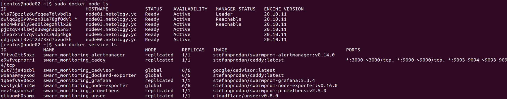

# Домашнее задание к занятию "5.5. Оркестрация кластером Docker контейнеров на примере Docker Swarm"

---

## Задача 1

Дайте письменые ответы на следующие вопросы:

- В чём отличие режимов работы сервисов в Docker Swarm кластере: replication и global?
>Ответ: В режиме replication сервис запускается на нодах в указанном количестве (не обязательно на всех нодах). В режиме global - экземпляр сервиса запускается на всех нодах. 


- Какой алгоритм выбора лидера используется в Docker Swarm кластере?
>Ответ: Все ноды в клстере делятся на управляющие (manager) и рабочие (workers). Управлющих нод обычно не менее трех. Упраляющие ноды таже выполнаюи функции и рабочих нод. Первая управляющая нода в кластере автоматические становится ведущей, остальные находяся в режиме ожидания (статуса). Если лидируещая нода становится недоступной или ведет себя нестабильно, то происходит выбор новой ведущей ноды по алгоритму поддержания распредленногос консенсуса raft.

Если обычный узел долго не получает сообщений от лидера, то он переходит в состояние «кандидат» и посылает другим узлам запрос на голосование. Другие узлы голосуют за того кандидата, от которого они получили первый запрос. Если кандидат получает сообщение от лидера, то он снимает свою кандидатуру и возвращается в обычное состояние. Если кандидат получает большинство голосов, то он становится лидером. Если же он не получил большинства (это случай, когда на кластере возникли сразу несколько кандидатов и голоса разделились), то кандидат ждёт случайное время и инициирует новую процедуру голосования.

Процедура голосования повторяется, пока не будет выбран лидер.

- Что такое Overlay Network?
>Ответ
Наложенная сеть 
Логическая сеть, создаваеммая поверх другой сети. Узлы оверлейной сети могут быть связаны либо физическим соединением, либо логическим, для которого в основной сети существуют один или несколько соответствующих маршрутов из физических соединений. 

## Задача 2

Создать ваш первый Docker Swarm кластер в Яндекс.Облаке

Для получения зачета, вам необходимо предоставить скриншот из терминала (консоли), с выводом команды:
```
docker node ls
```
>Ответ
[centos@node02 ~]$ sudo docker node ls
ID                            HOSTNAME             STATUS    AVAILABILITY   MANAGER STATUS   ENGINE VERSION
vis73pzziz6ufzqea7divbdls     node01.netology.yc   Ready     Active         Leader           20.10.11
dwiqq2g0v9n4zx81a78gf0dvl *   node02.netology.yc   Ready     Active         Reachable        20.10.11
en24wkn8ly5ed0i2egzhllx28     node03.netology.yc   Ready     Active         Reachable        20.10.11
pjczqv44lswjs3wwgn3qo5n57     node04.netology.yc   Ready     Active                          20.10.11
lfep7xiri7qvlw57s39dp4kg8     node05.netology.yc   Ready     Active                          20.10.11
qdjzpauf3vsf2d73xd7avud5h     node06.netology.yc   Ready     Active                          20.10.11


## Задача 3

Создать ваш первый, готовый к боевой эксплуатации кластер мониторинга, состоящий из стека микросервисов.

Для получения зачета, вам необходимо предоставить скриншот из терминала (консоли), с выводом команды:
```
docker service ls
```
>Ответ
[centos@node02 ~]$ sudo docker service ls
ID             NAME                                MODE         REPLICAS   IMAGE                                          PORTS
7ftvu2tt5bxz   swarm_monitoring_alertmanager       replicated   1/1        stefanprodan/swarmprom-alertmanager:v0.14.0    
a9wfvepmprr1   swarm_monitoring_caddy              replicated   1/1        stefanprodan/caddy:latest                      *:3000->3000/tcp, *:9090->9090/tcp, *:9093-9094->9093-9094/tcp
qwt7jja4pzbl   swarm_monitoring_cadvisor           global       6/6        google/cadvisor:latest                         
w0ahammyyxod   swarm_monitoring_dockerd-exporter   global       6/6        stefanprodan/caddy:latest                      
1q6efv9v06cx   swarm_monitoring_grafana            replicated   1/1        stefanprodan/swarmprom-grafana:5.3.4           
vwslyqktnz4w   swarm_monitoring_node-exporter      global       6/6        stefanprodan/swarmprom-node-exporter:v0.16.0   
mez1sgaomkaf   swarm_monitoring_prometheus         replicated   1/1        stefanprodan/swarmprom-prometheus:v2.5.0       
qtkuomh0samx   swarm_monitoring_unsee              replicated   1/1        cloudflare/unsee:v0.8.0      


<p align="center">
  
</p>

## Задача 4 (*)

Выполнить на лидере Docker Swarm кластера команду (указанную ниже) и дать письменное описание её функционала, что она делает и зачем она нужна:
```
# см.документацию: https://docs.docker.com/engine/swarm/swarm_manager_locking/
docker swarm update --autolock=true
```

>Ответ
sudo docker swarm update --autolock=true
Swarm updated.
To unlock a swarm manager after it restarts, run the `docker swarm unlock`
command and provide the following key:
>
>    SWMKEY-1-uZJDsJeebDOzqdrievqqpnLMMhTccXpkLLcxzFUoLK4
>
>Please remember to store this key in a password manager, since without it you
will not be able to restart the manager.

>Опция --autolock=true повзволяет блокировать swarm (рой) при перезапуске.
>Существуют журналы Raft которые по умолчанию зашиврованы. Это шифрование позволяет защитить конфигурацию от злоумыленников которые могут получить доступ к зашифрованынм журналам.
>Связь между Docker контейнерами также шифруется.
>Docker позволяет защитить ключ шифрования журналов raft и ключ шифрования связи между контейнерами дополнительным ключем бловироки и разблокировки роя (котоыре ме сейчас сгенерили). Этот ключ будет запрашиваться каждый раз при перезапуске Docker для ручной разблокировки.

