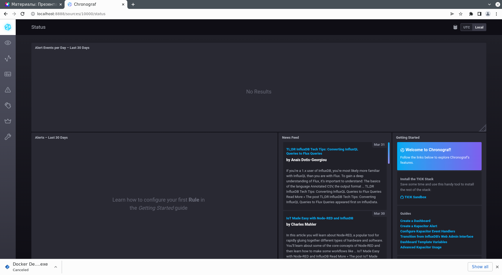
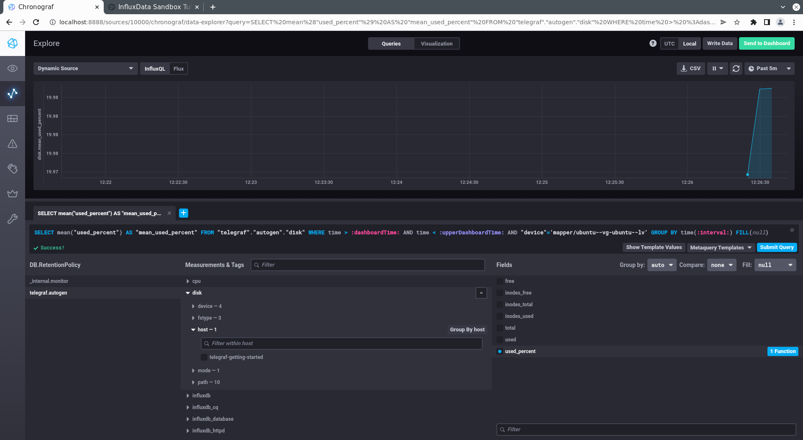
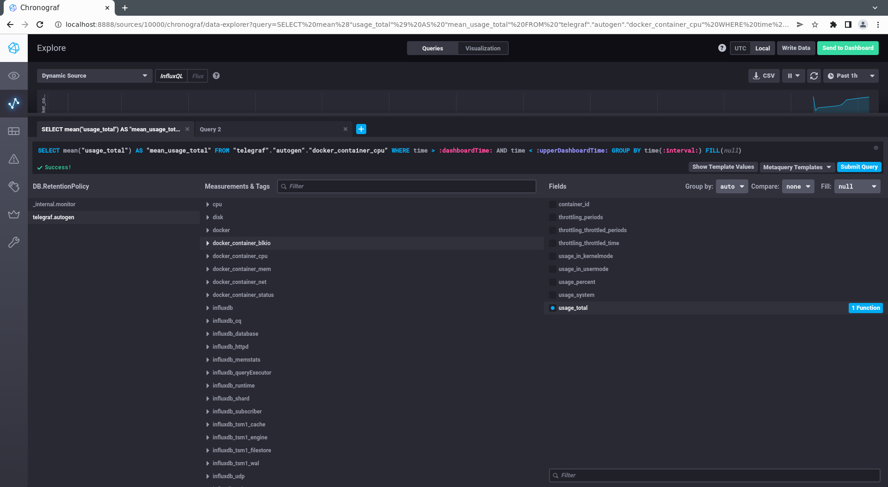

# Домашнее задание к занятию "10.02. Системы мониторинга"

## Обязательные задания

1. Опишите основные плюсы и минусы pull и push систем мониторинга.
   
   ```
   Pull модель подразумевает собой сбор данных с хостов. Push модель это отправка в систему мониторинга метрик.

   При Pull модели централизовано настраивается список хостов которые нужно опрашивать. Следовательно, больше контроля над тем какие данные и откуда они приходят и с какой периодичностью.

   При pull модели весь трафик можно пропускать через защищенный Proxy сервер, настройки подключения к которому можно указать всего один раз на сервере мониторинга.

   При pull модели проще отлаживать и поддерживать систему, т.к. нет необходимости подключаться к каждому хосту и проверять коннект с сервером и проверять отправляются ли запросы на сервер. 


   При Push модели основные настройки взаимодействия с сервером делаются на клиентах (на хостах с которых отправляются метрики)
   Сервер мониторинга может получать данные с различных(неизвестных заранее) источников с различной периодичностью согласно настройкам на клиентах.
   
   При Push модели можно использовать более быстрый UDP протокол передачи данных за счет чего можно увеличить частоту отправки данных. 

   ```
   

2. Какие из ниже перечисленных систем относятся к push модели, а какие к pull? А может есть гибридные?

    - Prometheus  pull-модель 
    - TICK  push-модель
    - Zabbix (push и pull)
    - VictoriaMetrics (Используется как СУБД для хранения временных рядов)
    - Nagios push-модель

3. Склонируйте себе [репозиторий](https://github.com/influxdata/sandbox/tree/master) и запустите TICK-стэк, 
используя технологии docker и docker-compose.

В виде решения на это упражнение приведите выводы команд с вашего компьютера (виртуальной машины):

    - curl http://localhost:8086/ping
    - curl http://localhost:8888
    - curl http://localhost:9092/kapacitor/v1/ping

```
opsuser@opsserver:~/home_works/10-monitoring-02-systems$ curl -sl -I localhost:8086/ping
HTTP/1.1 204 No Content
Content-Type: application/json
Request-Id: c6d7dedf-b299-11ec-8702-0242ac120003
X-Influxdb-Build: OSS
X-Influxdb-Version: 1.8.10
X-Request-Id: c6d7dedf-b299-11ec-8702-0242ac120003
Date: Sat, 02 Apr 2022 15:30:07 GMT

```
```
opsuser@opsserver:~/home_works/10-monitoring-02-systems$ curl -sl -I localhost:8888
HTTP/1.1 200 OK
Accept-Ranges: bytes
Cache-Control: public, max-age=3600
Content-Length: 336
Content-Security-Policy: script-src 'self'; object-src 'self'
Content-Type: text/html; charset=utf-8
Etag: "3362220244"
Last-Modified: Tue, 22 Mar 2022 20:02:44 GMT
Vary: Accept-Encoding
X-Chronograf-Version: 1.9.4
X-Content-Type-Options: nosniff
X-Frame-Options: SAMEORIGIN
X-Xss-Protection: 1; mode=block
Date: Sat, 02 Apr 2022 15:31:37 GMT

```
```
opsuser@opsserver:~/home_works/10-monitoring-02-systems$ curl -sl -I http://localhost:9092/kapacitor/v1/ping
HTTP/1.1 204 No Content
Content-Type: application/json; charset=utf-8
Request-Id: 0bba152a-b29a-11ec-871e-000000000000
X-Kapacitor-Version: 1.6.4
Date: Sat, 02 Apr 2022 15:32:03 GMT

```
А также скриншот веб-интерфейса ПО chronograf (`http://localhost:8888`). 



P.S.: если при запуске некоторые контейнеры будут падать с ошибкой - проставьте им режим `Z`, например
`./data:/var/lib:Z`

4. Перейдите в веб-интерфейс Chronograf (`http://localhost:8888`) и откройте вкладку `Data explorer`.

    - Нажмите на кнопку `Add a query`
    - Изучите вывод интерфейса и выберите БД `telegraf.autogen`
    - В `measurments` выберите mem->host->telegraf_container_id , а в `fields` выберите used_percent. 
    Внизу появится график утилизации оперативной памяти в контейнере telegraf.
    - Вверху вы можете увидеть запрос, аналогичный SQL-синтаксису. 
    Поэкспериментируйте с запросом, попробуйте изменить группировку и интервал наблюдений.

Для выполнения задания приведите скриншот с отображением метрик утилизации места на диске 
(disk->host->telegraf_container_id) из веб-интерфейса.




5. Изучите список [telegraf inputs](https://github.com/influxdata/telegraf/tree/master/plugins/inputs). 
Добавьте в конфигурацию telegraf следующий плагин - [docker](https://github.com/influxdata/telegraf/tree/master/plugins/inputs/docker):
```
[[inputs.docker]]
  endpoint = "unix:///var/run/docker.sock"
```

Дополнительно вам может потребоваться донастройка контейнера telegraf в `docker-compose.yml` дополнительного volume и 
режима privileged:
```
  telegraf:
    image: telegraf:1.4.0
    privileged: true
    volumes:
      - ./etc/telegraf.conf:/etc/telegraf/telegraf.conf:Z
      - /var/run/docker.sock:/var/run/docker.sock:Z
    links:
      - influxdb
    ports:
      - "8092:8092/udp"
      - "8094:8094"
      - "8125:8125/udp"
```


Ответ:
telegraf.conf
```
[[inputs.docker]]
  endpoint = "unix:///var/run/docker.sock"
  container_name_include = []
  timeout = "5s"
  perdevice = true
  total = false
  source_tag = false
  docker_label_include = []
```

docker-composr.yml
```
 telegraf:
    # Full tag list: https://hub.docker.com/r/library/telegraf/tags/
    build:
      context: ./images/telegraf/
      dockerfile: ./${TYPE}/Dockerfile
      args:
        TELEGRAF_TAG: ${TELEGRAF_TAG}
    image: telegraf:1.4.0
    privileged: true
    environment:
      HOSTNAME: "telegraf-getting-started"
    # Telegraf requires network access to InfluxDB
    links:
      - influxdb
    volumes:
      # Mount for telegraf configuration
      - ./telegraf/telegraf.conf:/etc/telegraf/telegraf.conf
      # Mount for Docker API access
      - /var/run/docker.sock:/var/run/docker.sock
    depends_on:
      - influxdb
    ports:
      - "8092:8092/udp"
      - "8094:8094"
      - "8125:8125/udp"
```
```
Пришлось на хостовой машине права выдать на докер сокет: sudo chmod -R 777 /var/run/docker.sock
```

После настройке перезапустите telegraf, обновите веб интерфейс и приведите скриншотом список `measurments` в 
веб-интерфейсе базы telegraf.autogen . Там должны появиться метрики, связанные с docker.




Факультативно можете изучить какие метрики собирает telegraf после выполнения данного задания.

## Дополнительное задание (со звездочкой*) - необязательно к выполнению

В веб-интерфейсе откройте вкладку `Dashboards`. Попробуйте создать свой dashboard с отображением:

    - утилизации ЦПУ
    - количества использованного RAM
    - утилизации пространства на дисках
    - количество поднятых контейнеров
    - аптайм
    - ...
    - фантазируйте)
    
    ---

### Как оформить ДЗ?

Выполненное домашнее задание пришлите ссылкой на .md-файл в вашем репозитории.

---

